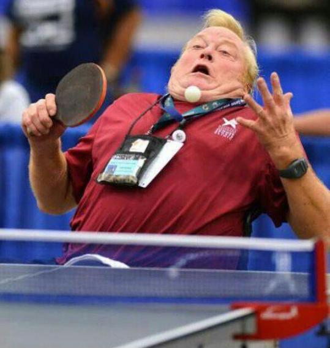

# Project 3: Collaboration and Competition

### Introduction

In this project it is proposed to solve a problem where there are two agents that collaborate and compete. Specifically the environment is a game of **ping pong** where each agent should try to avoid losing. +0.1 if it hits the ball and -0.01 if an agent lets a ball hit the ground or hits the ball out of bounds.

Although this problem is multi agent, it has the particularity that they do not have the need to know the other agent's information and act accordingly. Therefore you can use a conventional DDPG, which works with multiple agents and a shared replay buffer that makes it learn a single **DDPG network.**



In the first instance, we should try to formalize the problem proposed in one of RL.

| Variable name | Description                                                  |
| ------------- | ------------------------------------------------------------ |
| **state**     | A set of 8 sensors that describe the information of the current state. |
| **actions**   | A set of 2 continuous actions.                               |
| **reward**    | +0.1 if the agent hit the ball or -0.01 if the agent lets a ball hit the ground or hits the ball of of bounds. |

Once the problem is defined, we must remember that an RL problem is simply a **maximization problem.** In contrast the previous project, in this case we use a maximization problem that combine: Actor-Network and Critic-Network.

The problem can be resolved exactly as the previous project, the small difference is the great instability to depend on the state of the environment of another agent. With this you can ask us a question: **What would happen both agents have not yet learned and never hit the ball?**

### Project structure

The project has estructured as following:

- **README.md**
- **Report.pdf**: Document that explain all implementation.
- **Tennis.ipynb:** The continuous control project jupyter notebook.
- *code*: implementation of the DQN, agent, etc.
  - **agent.py**: Definition of the used agent.
  - **config.py**: Configuration of paths, pytorch device and hyperparameters.
  - **model.py**: Network architectures.
- *doc*: additional images, etc for readme.
- *envs*: location of the used environments.
  - *tennis*
- *checkpoints*: saved checkpoints during training:
  - *tennis*
- *models*: saved final models:
  - *tennis*


### Download Environment

For this project, you will **not** need to install Unity - this is because we have already built the environment for you, and you can download it from one of the links below. You need only select the environment that matches your operating system:

- Linux: [click here](https://s3-us-west-1.amazonaws.com/udacity-drlnd/P3/Tennis/Tennis_Linux.zip)
- Mac OSX: [click here](https://s3-us-west-1.amazonaws.com/udacity-drlnd/P3/Tennis/Tennis.app.zip)
- Windows (32-bit): [click here](https://s3-us-west-1.amazonaws.com/udacity-drlnd/P3/Tennis/Tennis_Windows_x86.zip)
- Windows (64-bit): [click here](https://s3-us-west-1.amazonaws.com/udacity-drlnd/P3/Tennis/Tennis_Windows_x86_64.zip)

Once downloaded, you must save it in **envs/tennis** . If the version is different from Linux, you must modify the config.py paths to read them properly.

### Getting Started

1. Download the environment and put in the envs location.
2. Change the path ```code/config.py```  if your operative system is different than Linux.
3. Use ```jupyter notebook``` to view both projects. Or execute ``` python ./code/DDPG.py```.